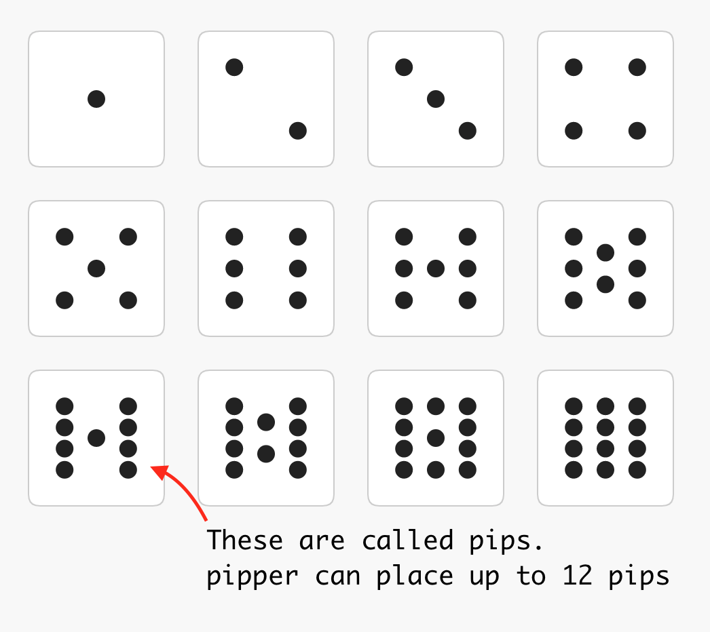

# pipper

A program to place pips pleasingly.



## Installation

```sh
npm install --save pipper
```

## Usage

```js
import pipper from "pipper";

const pips = pipper(1, 10, 100, 100);
// [100, 100] <- this is the center of your one pip
```

## API

### `pipper(pips, pipSize, cx, cy)`

- `pips` (`number`, required)
- `pipSize` (`number`, required)
- `cx` (`number`, required)
- `cy` (`number`, required)
- returns `number[][]` ([ [cx0, cy0], [cx1, cy1]... ])
